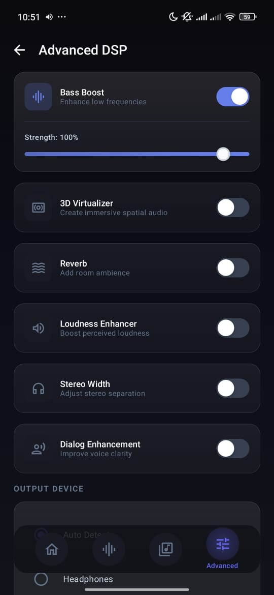
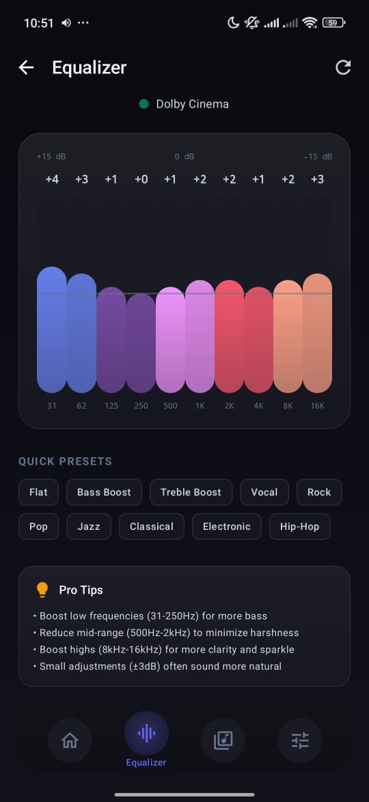
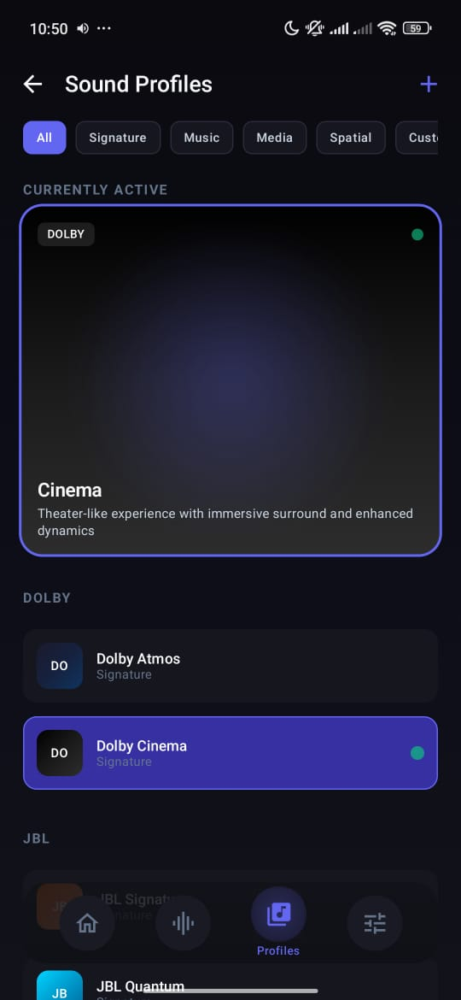
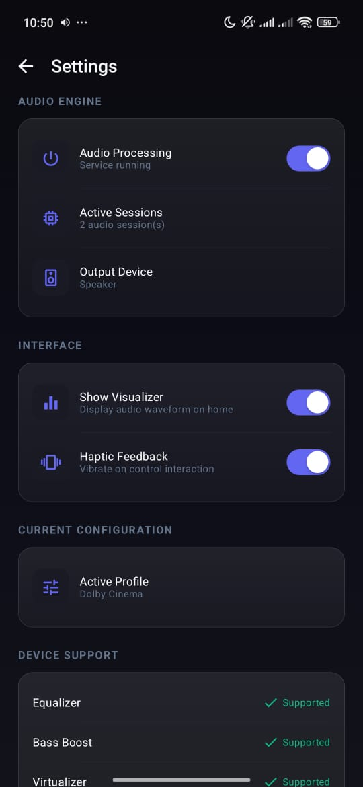
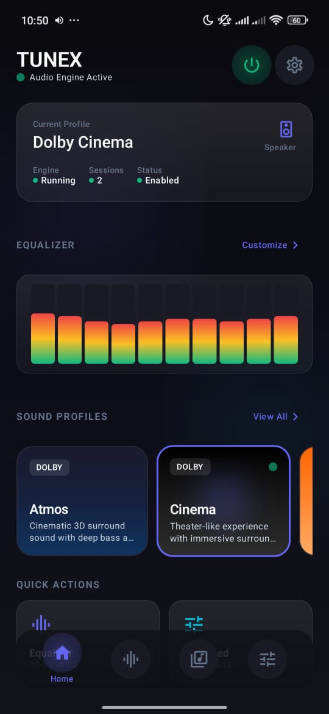

# Tunex

A system-wide audio equalizer for Android. No root required.


## What is this?

Tunex is an equalizer app that works across all audio on your device. It uses Android's AudioEffect API to apply EQ and DSP effects to any app playing audio.

**Features:**
- 10-band parametric equalizer (-15dB to +15dB)
- Sound profiles (Dolby-style, JBL, Sony, etc.)
- Bass boost, virtualizer, reverb
- Loudness enhancer
- Stereo width control
- Works in background as a service
- Dark theme UI

## Screenshots

<p align="center">
  
  
  
</p>
<p align="center">
  
  
</p>

## Requirements

- Android 10 (API 29) or higher
- No root needed

## Building

Clone the repo and open in Android Studio:

```bash
git clone https://github.com/Bytegarden-X/tunex.git
cd tunex
```

Build debug APK:
```bash
./gradlew assembleDebug
```

APK will be in `app/build/outputs/apk/debug/`

## Project Structure

```
app/src/main/java/com/tunex/
├── audio/
│   ├── engine/          # AudioEffect wrappers
│   └── service/         # Background processing service
├── data/
│   ├── model/           # Data classes
│   └── repository/      # DataStore persistence
├── receiver/            # Boot & audio session receivers  
└── ui/
    ├── components/      # Reusable Compose components
    ├── screens/         # App screens
    ├── navigation/      # Nav setup
    ├── theme/           # Colors, typography, shapes
    └── viewmodel/       # State management
```

## How it works

1. App starts a foreground service that listens for audio sessions
2. When any app starts playing audio, we attach our effects to that session
3. EQ, bass boost, virtualizer, reverb get applied in real-time
4. Settings are persisted using DataStore

The "brand profiles" (Dolby, JBL, etc.) are just EQ presets that try to match the sound signature of those brands. We don't use any proprietary algorithms.

## Known Issues

- Some apps with their own audio processing might conflict
- Bluetooth latency can vary by device
- Samsung devices sometimes need audio restart to apply effects

## Contributing

PRs welcome. Please test on a real device before submitting.

## License

GPL v3 - see [LICENSE](LICENSE) file.

Free to use, modify, and distribute. If you fork this, keep it open source.

---

Made by [@Bytegarden-X](https://github.com/Bytegarden-X)
